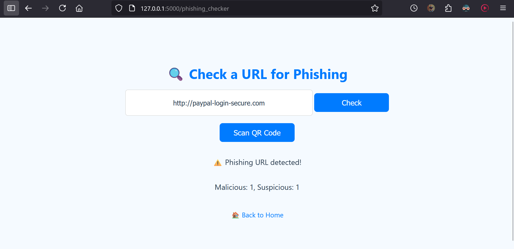
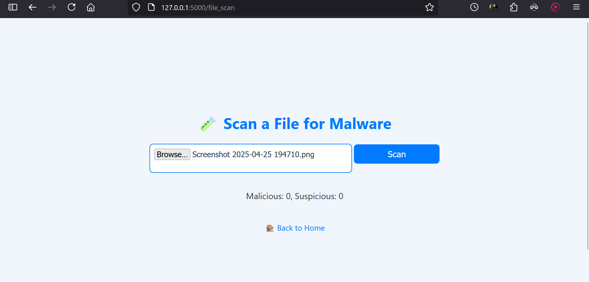
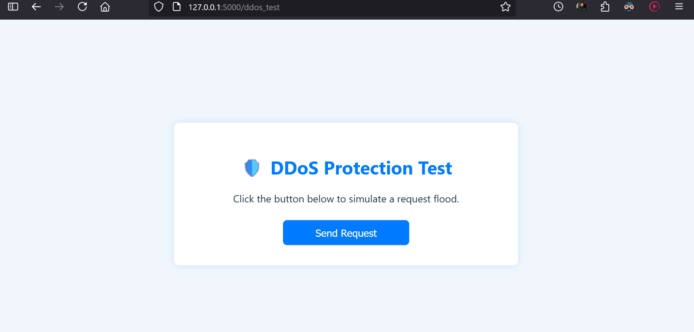

# Threat Guard

**Threat Guard** is a cyber safety web app built using Python's Flask framework. It integrates real-time scanning of URLs, QR codes and files using the VirusTotal API, checks for compromised passwords via HaveIBeenPwned, blocks DDoS attempts through rate limiting, and stores users data and phishing-related data securely using SQLite databases.

## Table of Contents

- [Features](#features)
- [Screenshots](#screenshots)
- [Usage](#usage)
- [Documentation](#documentation)
- [Technologies Used](#technologies-used)
- [Contributing](#contributing)
- [License](#license)

## Features

- **URL and File Scanning**: Scan links, QR codes, and uploaded files for malware and phishing threats.
- **Pawned Detection**: Check if emails or passwords have been exposed in data breaches using the HaveIBeenPwned API.
- **User Authentication**: Secure sign-up/login system with hashed passwords.
- **Database Architecture**: SQLite used for storing users, phishing URLs, IPs, and breach data.

## Screenshots

## Usage

1. Clone the repository:
   `git clone https://github.com/miansaadtahir/threat-guard.git`
2. Navigate to the project directory:
   `cd threat-guard`
3. Install required dependencies
4. Run the app by typing `python app.py` in terminal.
5. Open the provided local address in your browser to start using the app.

## Documentation

For a detailed overview of the project, refer to the [Documentation](./documentation) in the repository.

## Technologies Used

- Python
- Flask
- SQLite
- Flask-Limiter
- Jinja2
- HTML5
- CSS3
- JS
- VirusTotal API
- HaveIBeenPwned API

## Contributing

Contributions, issues, and feature requests are welcome!  
Feel free to check out the [issues page](https://github.com/miansaadtahir/Threat-Guard/issues) for more information.

## License

Distributed under the MIT License. See [LICENSE](./LICENSE) for more details.
